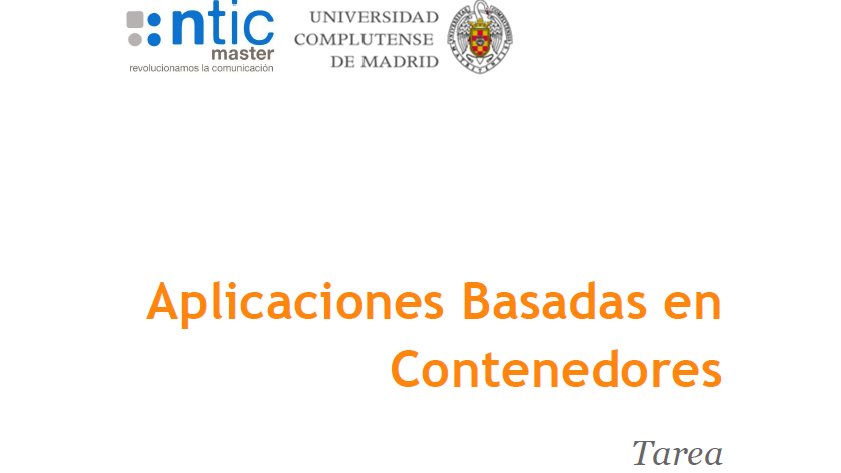
### Profesor: Óscar Gómez Soriano
### Alumno: Joaquín Pérez Carrasco

## <span style="color: #0074D9">Apartado 1 - Explicación Solución Arquitectura.</span>

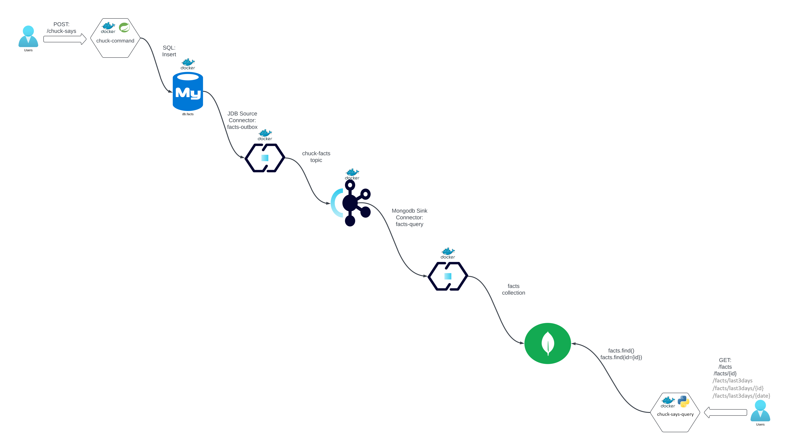

Para esta solución de arquitectura, se ha pensado en implementar un CQRS (Command Query Responsability Segregation),
con un patrón OutBox Pattern Transaccional. Vamos por partes.

1 - En primer lugar, como es necesario capturar eventos que nos proporciona alguien de forma externa (en este caso Facts de
    Chuck Norris), esto se simula realizándole un POST hacia el endpoint /chucksays y por dentro lo que ocurre es que existe
    una app dockerizada con un Servicio Spring Boot (Chuck-Command), que cuando recibe este POST, genera mediante un Faker,
    un mensaje Fact aleatorio, junto con un id y un timestamp actual, y que transfiere esta información a una base de datos de MySQL.

```bash
curl -X POST http://localhost:28080/chuck-says
```
Ejemplo de post realizado por un script bash (.sh):
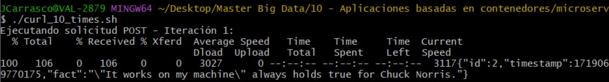

2 - La BBDD MySQL se encuentra Dockerizada, y es la que recibe las escritura de los mensajes de Facts que genera el
    servicio anteriormente comentado. Por cómo funcionan este tipo de bases de datos, las hace ideales, ya que nos 
    proporciona fiabilidad y transaccionalidad.

3 - Ahora ocurre una cosa, y es que, para que cumpla con la arquitectura de tipo CQRS, se tiene que cumplir que la zona
    de escritura y de lectura de los datos se encuentren desacopladas entre sí gracias al empleo de interfaces o APIs.
    Además, se consigue una comunicación de manera asíncrona (Request/Response). Para poder realizar esta separación entre
    ambas partes, se empleará Kafka (que también se alojará en otro contenedor docker), que como ya sabemos de la
    asignatura anteriormente cursada en este Máster, tiene la propiedad de almacenar los mensajes que le van llegando
    de manera ordenada y dejarlo listos para que otro servicio pueda consumirlo.

4 - Entre el punto 2 y 3, es decir entre MySQL y Kafka, existe otro contenedor con Connect, al que se le instala un 
    conector de tipo "Source", con el que será capaz de ir cogiendo los mensajes que tenga la BBDD e ir transfiriéndolos
    hacia un tópico de Kafka denominado "chuck-facts". Hasta este punto, es importante resaltar que todo esto actúa como
    un patro OutBox Pattern, es decir, la pieza Chuck-Command escribe a la BBDD MySQL de forma transaccional y
    posteriormente, gracias al conector JDBC (fact-outbox), se disponibiliza el dato en el topico de Kafka "chuck-facts"
    y asegura la consistencia eventual (se garantiza que lo último que se sabe del dato que se ha persistido es cierto).

5 - En otro Connect, se realiza la instalación de un Sink Connector "facts-query", para que se pueda capturar el dato, y mandar hacia
    una base de datos de MongoDB, que se encuentra dockerizada también. Esto es importante ya que, al leer el topic de 
    "chuck-facts" y escribiendo a esa BBDD NoSQL, se asegura la segregación entre la escritura (Chuck-Command) y la
    lectura (Chuck-Query), por lo que se sigue asegurando la consistencia eventual. Además, como se está empleando como
    solución una BBDD NoSQL, podemos tener unas lecturas (búsquedas de documentos), optimizada.

6 - Una vez el dato está aquí en la BBDD NoSQL, se pone en disposición un servicio denominado chuck-says-query, desarrollado
    en Python, que levanta un servidor Flask dentro del contenedor, al que se pueden mandar solicitudes a través de 5 
    endpoints, expone dos enpoints rest, que ejecutan queries sobre la coleccion test.facts de MongoDB y devuelve
    la estructura del documento en formato JSON.

```bash
# Obtiene todos los facts disponibles.
GET: >> curl http://localhost:48080/facts
``` 
Resultado de ejemplo:
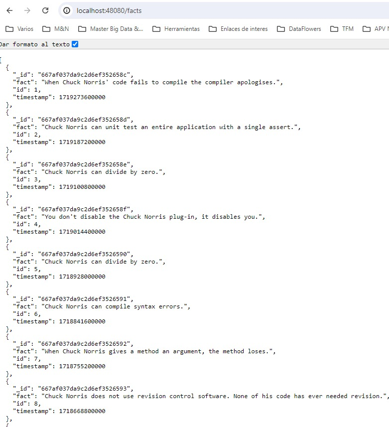

```bash
# Filtra de todos los facts por UUID.
GET: >> curl http://localhost:48080/{id} 
``` 
Resultado de ejemplo:
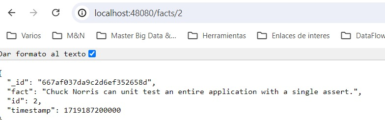

```bash
# Filtra los facts de los ultimos 3 dias y los muestra.
GET: >> curl http://localhost:48080/fact/last3days 
``` 
Resultado de ejemplo:
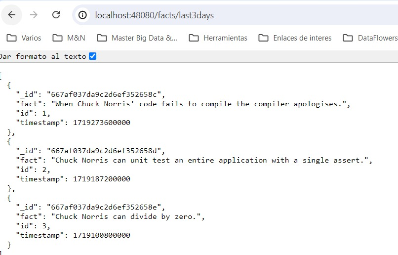

```bash
# Filtra los facts de los último 3 dias y por UUID.
GET: >> curl http://localhost:48080/fact/last3days/{id} 
``` 
Resultado de ejemplo:
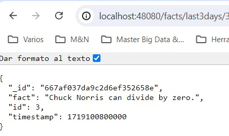

```bash
# Filtra por los facts de los últimos 3 días y por un timestamp concreto en formato 'YYYY/MM/DD'.
GET: >> curl http://localhost:48080/fact/last3days/{date} 
``` 
Resultado de ejemplo:
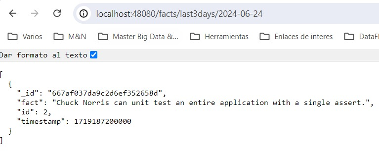

Aunque los dos primeros endpoints se mantienen por motivos históricos en el Script de base, se han añadido los otros tres
para poder dar respuesta a los requisitos pedidos para la realización del entregable.

## <span style="color: #0074D9">Apartado 2 - Diseño y Documentación de la APIs.</span>

En este apartado adjuntaremos la documentación Swagger realizada en su version OpenApi v3, mostrando los distintos
endpoints, tanto de entrada como de salida del microservicio, y de la estructura de la entidad "Fact" empleada.

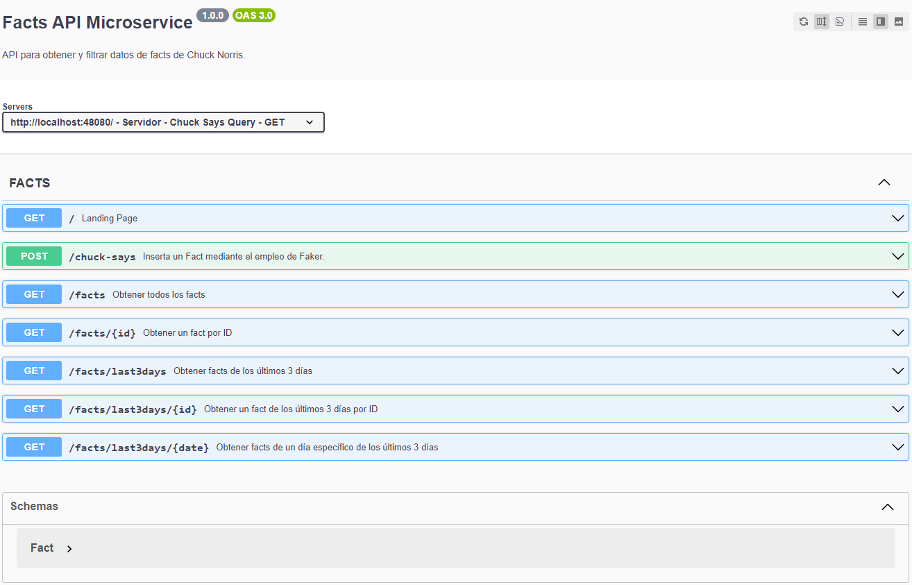

**Imagen:** Previsualización documentación Swagger.

---

Pulsa para llevarte al enlace --> [Documentación Swagger](2.Chuck-MicroService_Swagger.yaml) 

**Para poder lanzar request GET y POST directamente sobre ese Swagger y ver las respuestas aquí, es necesario lanzar
[start.sh file](../1.microservice_architecture/environment/start.sh):**

```bash
./start.sh # Situarse previamente en ../../1.microservice_architecture/environment/start.sh
```

Además, si se quiere tener datos a uno por día más o menos distribuidos, es decir, a partir del día actual, modificar de
los facts existentes, actualizar la fecha "manualmente" para comprobar que lo implementado en Docker con Python y Flask
(Chuck-Says-Query) funciona correctamente. Esto evita tener que modificar Chuck-Command, en pos de acelerar las comprobaciones.
Para esto, basta con entrar al docker de Mongo e inyectar el siguiente código JS:

```
# Abrir una consola de PS para entrar a MongoDB:
>> docker exec -it mongo /bin/bash
>> mongosh
>> Copiamos el código javascript que se muestra abajo.
```

```javascript
//Inyección para hacer update a las fechas que tenemos... a mongo.
// Definir una fecha base para la inicialización de los timestamps
var baseDate = new Date("2024-06-27");

// Variable para almacenar el timestamp actual en milisegundos
var currentTimestamp = baseDate.getTime(); // Tiempo en milisegundos de la fecha base

// Consultar y actualizar cada documento en la colección 'facts'
db.facts.find().forEach(function(doc) {
    // Actualizar el timestamp del documento actual
    db.facts.update(
        { _id: doc._id },
        { $set: { timestamp: currentTimestamp } }
    );

    // Decrementar el timestamp para el siguiente documento en un día (86400000 milisegundos)
    currentTimestamp -= 86400000; // 86400000 milisegundos = 1 día
});
```

## <span style="color: #0074D9">Apartado 3 - Implementación del servicio de chuck-says-query.</span>

### DockerFile

En este apartado se va a dejar adjunto el DockerFile del servicio solicitado, además del enlace de la imagen a DockerHub
y de los ficheros YAML empleado para los recursos de K8s.

* Enlace al DockerFile: [chuck-says-query DockerFile](../3.Tarea/chuck-says-query/Dockerfile)

* Enlace al app.py modificado, para cumplir con los requisitos funcionales del apartado 1: [app.py Contenerizado](../3.Tarea/chuck-says-query/app.py)

### DockerHub

Enlace a DockerHub: [DockerHub jpcarrasco96](https://hub.docker.com/r/jpcarrasco96/chuck-says-query)

#### Proceso de subir la imagen a DockerHub
```shell
# Situarse en ../3.Tarea/chuck-says-query, que es donde se encuentra el DockerFile.
docker build -t chuck-says-query .

# Iniciar sesión en Docker Hub.
docker login

# Etiquetar la imagen Docker recién creada con el nombre de usuario de Docker Hub y el nombre del repositorio.
docker tag chuck-says-query jpcarrasco96/chuck-says-query:latest

# Subir la imagen Docker etiquetada a Docker Hub.
docker push jpcarrasco96/chuck-says-query:latest
``` 

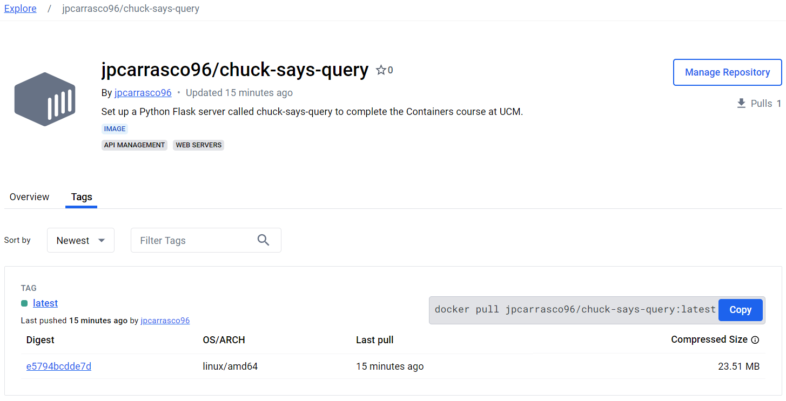

### Kubernetes Resources

El directorio `3.Tarea/chuck-says-query/k8s_resources` contiene los siguientes archivos:

- [chuck-says-api-config](../3.Tarea/chuck-says-query/k8s_resources/chuck-says-api-config.yaml): No es necesario, ya que
se pone de forma hardcodeadas las rutas en el config.properties al levantarse la App con el servicio Flask. Se deja a modo
de aprender el cómo se haría en este caso. **Realmente se van a usar los dos que se enseñan a continuación.**
- [chuck-says-api-service](../3.Tarea/chuck-says-query/k8s_resources/chuck-says-api-service.yaml)
- [chuck-says-api-deployment](../3.Tarea/chuck-says-query/k8s_resources/chuck-says-api-deployment.yaml)

El proceso para poder lanzar esto mediante LoadBalancer en un Cluster K3d:

```shell
# 0 - Para evitar conflictos de nombres o cluster ya creados, se han borrados todos los que existían. 
k3d cluster delete mycluster 

# 1 - Situarse en ../3.Tarea/chuck-says-query/k8s_resources, que es donde se encuentran los recursos
# para el despliegue en k3d. Se crea el cluster llamado my-cluster
k3d cluster create mycluster --api-port 6550 -p "8081:80@loadbalancer" --agents 2
# K3D se despliega por defecto con un servicio de Ingress Controller `traeffik` pero no es capaz de exponer la red docker
# asociada a él en el sistema host por lo que al crear el cluster se hace un mapeo de puertos, exponiendo el loadbalancer
# (traeffik) de K3d por el puerto 8081 en la red del sistema host. De este modo, una vez creados los recursos, k8s
# podremos acceder al servicio (GET).

# 2 -  Aplicamos los distintos YAML.
kubectl apply -f chuck-says-api-service.yaml
kubectl apply -f chuck-says-api-deployment.yaml

# 3 - Se comprueba que están instalados ambos y los logs del pod asociado al deployment.
>> kubectl get pods -o wide
NAME                               READY   STATUS    RESTARTS   AGE     IP          NODE                    NOMINATED NODE   READINESS GATES
chuck-says-query-664454c9f-4ddff   1/1     Running   0          5m13s   10.42.0.6   k3d-mycluster-agent-0   <none>           <none>

>> kubectl get services
NAME               TYPE           CLUSTER-IP    EXTERNAL-IP                        PORT(S)          AGE
kubernetes         ClusterIP      10.43.0.1     <none>                             443/TCP          19m
chuck-says-query   LoadBalancer   10.43.71.26   172.22.0.3,172.22.0.4,172.22.0.5   8081:30151/TCP   3m45s

>> kubectl logs chuck-says-query-664454c9f-4ddff
 * Serving Flask app 'app'
 * Debug mode: off
WARNING: This is a development server. Do not use it in a production deployment. Use a production WSGI server instead.
 * Running on all addresses (0.0.0.0)
 * Running on http://127.0.0.1:48080
 * Running on http://10.42.0.6:48080
Press CTRL+C to quit
``` 
Como curiosidad extra, se ha podido probar a ver estos logs en la terminal de un visor de Kubernetes OpenSource denominado
OpenLens:

### chuck-says-query deployment

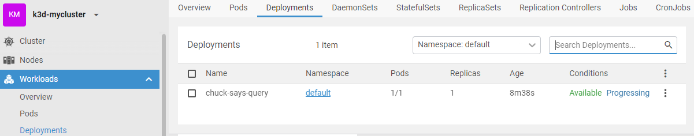

### chuck-says-query service

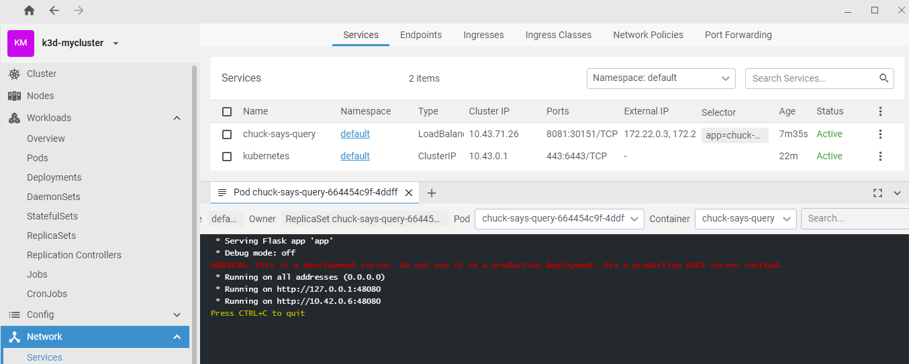
